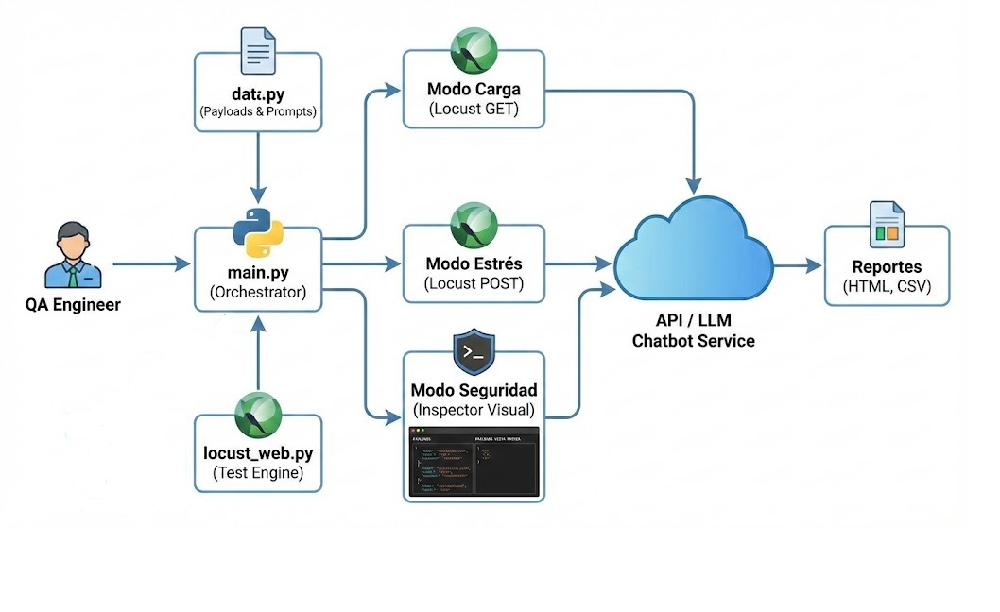

# Framework de Carga y Estrés

Este framework es una herramienta de línea de comandos (CLI) diseñada para **QA Engineers** y **desarrolladores de IA**. 

Su objetivo es evaluar el rendimiento de modelos de lenguaje (LLMs) y **auditar visualmente** los vectores de ataque que podrían vulnerarlos.

A diferencia de herramientas puramente automáticas, este framework separa la ejecución de carga (automáticamente) de la revisión de seguridad (inspección de payloads), permitiendo al analista conocer exactamente qué preguntas de **Prompt Injection** o **Validación** se deben considerar.


===========================================================================


## 🏗️ Arquitectura del Framework



===========================================================================

## Estructura del Framework

Framework_QA/               # Directorio raíz del framework de Quality Assurance (QA).
│
│--data.py                  # Archivo encargado de la gestión de datos de prueba.
│--locust_web.py            # Archivo principal de definición de usuarios y tareas de Locust.
│--main.py                  # Punto de entrada del framework.
│--README.md                # Documento de referencia principal del proyecto.
│--requirements.txt         # Archivo que lista las dependencias necesarias para ejecutar el framework.
│--setup.py                 # Archivo de configuración para empaquetar e instalar el framework como un módulo de Python.


===========================================================================


## Capacidad del Framework


| Características                 | Descripción                                                                                                                                      |
|:--------------------------------| :----------------------------------------------------------------------------------------------------------------------------------------------- |
| **🚀 Pruebas de Carga**        | Automatización con Locust para simular usuarios concurrentes y medir tiempos de respuesta (SLA).                                                  |
| **🔥 Pruebas de Estrés**       | Generación masiva de peticiones para encontrar el punto de quiebre del servidor.                                                                  |
| **👁️ Auditoría de Seguridad**  | **Modo Inspección:** Visualización en consola de un banco de pruebas de seguridad (Inyecciones, Fugas de datos, Gobernanza) para revisión manual. |
| **📊 Reportes Automáticos**    | Generación de métricas en CSV y gráficos HTML en la carpeta `reports/`.                                                                           |


===========================================================================


## Diagrama de Prueba de Carga


===========================================================================


## Diagrama de Prueba de Estrés


===========================================================================


## 🎯 Configuración de URLs

Es fundamental distinguir qué URL ingresar según el tipo de prueba, ya que un error aquí invalidará los resultados:

| Modo                    | Tipo de URL            | Ejemplo                                    |
| :---------------------- | :--------------------- | :----------------------------------------- |
| **1. CARGA (Frontend)** | URL de la Página Web   | `https://mi-chatbot-qa.azurewebsites.net/` |
| **2. ESTRÉS (Backend)** | **Endpoint de la API** | `https://.../api/chat/message`             |

> ⚠️ **Advertencia:** > * En **Modo Carga**, el sistema solo verifica si la página "abre" (GET Request).
> * En **Modo Estrés**, el sistema **envía datos** (POST Request). Si usas la URL de la página web en lugar de la API, recibirás un error `405 Method Not Allowed`.

En el minuto ________ aparece comoo sacar el Endpoint de la API

===========================================================================


## Modos de Ejecución

El sistema cuenta con un menú interactivo con tres opciones claras:

### 1. Modo CARGA (Load Testing)
* **Acción:** Ejecuta ataques HTTP reales.
* **Objetivo:** Validar estabilidad bajo tráfico.
* **Métrica:** Verifica que el tiempo de respuesta sea **< 5 segundos (P95)**.
* **Resultado:** Genera reporte HTML/CSV.

### 2. Modo ESTRÉS (Stress Testing)
* **Acción:** Ejecuta ataques HTTP reales con alta concurrencia.
* **Objetivo:** Satura el modelo con prompts aleatorios para ver **errores 500** o lentitud en las respuestas.
* **Resultado:** Genera reporte HTML/CSV.

### 3. Modo SEGURIDAD (Payload Inspection)
* **Acción:** **Solo lectura** (No ejecuta ataques).
* **Objetivo:** Imprime en consola la lista completa de *Security Payloads* almacenada en `data.py`.
* **Uso:** Permite al QA copiar estos prompts para probarlos manualmente en el chat o auditorías de caja negra.


===========================================================================


## 🚀 Cómo ejecutar el Framework

Sigue estos pasos para poner en marcha el entorno de pruebas:

1.  **Pre-requisitos:** Asegúrate de tener Python 3.9 o superior instalado.
2.  **Instalación:** Instala las dependencias necesarias ejecutando:
    ```bash
    pip install -r requirements.txt
    ```
3.  **Ejecución:** Inicia el orquestador interactivo:
    ```bash
    python main.py
    ```
4.  **Interacción:** El sistema te pedirá:
    * Seleccionar el modo (1, 2 o 3).
    * Ingresar la URL del endpoint a probar (Ver tabla de URLs arriba).
    * Definir cantidad de usuarios y tiempo.

    
===========================================================================


## ¿Cómo interpretar los resultados?

Al finalizar una prueba, se generará un archivo HTML en la carpeta reports/. Busca estos valores clave:

En la parte final del HTML aparece un veredicto o resumen de la prueba realizada.

1. RPS (Requests Per Second): Cuántas preguntas puede responder tu IA por segundo.

   * Normal: 5-20 RPS (dependiendo de la GPU).
   * Bajo: < 2 RPS (Tu modelo es muy lento o pesado).

2. Failures (Fallos): Debe ser siempre 0%.

   * Si ves fallos en Modo Carga, tu servidor es inestable.
   * Si ves fallos en Modo Estrés, encontraste el límite de capacidad.

3. 95th Percentile (P95) Response Time: El tiempo que tardan el 95% de los usuarios.

   * En LLMs, esto suele ser alto (1-3 segundos). Si supera los 10 segundos, la experiencia de usuario es mala.

   
===========================================================================


## 💡 Casos de Uso (¿Cuándo usar este Framework?)

Este framework es ideal para los siguientes escenarios:

* **Validación de Nuevos Modelos (Release Testing):** Antes de pasar un chatbot a producción, utiliza el **Modo Carga** para asegurar que soporta el tráfico esperado sin latencia excesiva.
* **Pruebas de Regresión:** Después de modificar el *System Prompt* o la temperatura del modelo, ejecuta el **Modo Estrés** para confirmar que los cambios no degradaron el rendimiento del servidor.
* **Auditoría de Cumplimiento (Compliance):** Utiliza el **Modo Seguridad** para extraer los payloads y verificar manualmente si el modelo es capaz de filtrar intentos de robo de credenciales o generación de contenido tóxico.
* **Dimensionamiento de Infraestructura:** Ejecuta pruebas de estrés incrementales para determinar cuánta CPU/GPU necesitas contratar en tu proveedor de nube.


===========================================================================


## Disclaimer Ético

Esta herramienta ha sido creada únicamente para fines de aseguramiento de calidad (QA) en entornos controlados y autorizados.

El uso de los Payloads de Seguridad contra sistemas de terceros sin consentimiento explícito es ilegal y antiético. El autor no se hace responsable del mal uso de este software.